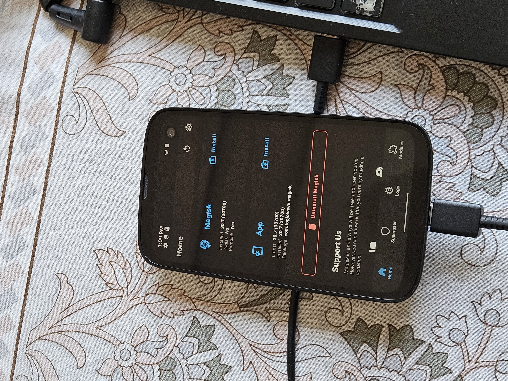

# A101BM Device Tree Research

Research notes for the **BALMUDA Phone A101BM** (SoftBank model): getting root via Magisk after unlocking the bootloader.

**Status: solved.** Root works. See [Getting root](#getting-root) below for the actual steps, and [Thanks](#thanks) for who made it possible.

This started as a from-source device-tree rebuild effort that hit a real dead end (still documented in `notes/FINDINGS.md`, kept for anyone interested in the detour). The actual working path turned out to be much simpler and came from someone else entirely - see below.

## Start here if you haven't unlocked the bootloader yet

You want **[unmuda](https://github.com/E2r7hN07Fl47/unmuda)** by **E2r7hN07Fl47** and **Mamkin_Xakep**, not this repo.

`unmuda` is the actual bootloader-unlock tool. It uses CVE-2024-31317 plus a Kyocera service-mode backdoor (`KcFastbootCheck()` / the `LOOTBFCK` chkcode magic) to unlock the bootloader on this exact phone. Everything in this repo starts *after* that's done.

Full credit to them for the unlock itself - this repo only exists because their work made it possible to get far enough to ask the next question.

If you're on Windows without WSL, see [`notes/unmuda-windows-newline-fix.md`](notes/unmuda-windows-newline-fix.md) first - it covers a real bug we hit and fixed in `cve31317.py`.

## Thanks

**[Mamkin-Xakep](https://github.com/Mamkin-Xakep)** (one of `unmuda`'s own authors) is the reason this actually works. After this repo documented the from-source build as a dead end, he dropped the real answer in [the GitHub issue](https://github.com/Stoobyy/Kyocera-A101BM-Exploitation/issues/1): use Android's own built-in DSU (Dynamic System Update) feature with a pre-rooted GSI to get temporary real root, then `dd` the actual stock partitions straight off the device. No kernel rebuild, no missing proprietary files, no guessing. Full credit - this unblocked the whole thing.



## Getting root

1. Unlock the bootloader with [unmuda](https://github.com/E2r7hN07Fl47/unmuda) first (see above).
2. Install [Shizuku](https://github.com/RikkaApps/Shizuku) or just use `adb shell am start-activity` directly - `com.android.dynsystem`'s `VerificationActivity` is launchable straight from adb, no extra app needed:
   ```
   adb push your-gsi.img.gz /storage/emulated/0/Download/gsi.img.gz
   adb shell am start-activity \
     -n com.android.dynsystem/com.android.dynsystem.VerificationActivity \
     -a android.os.image.action.START_INSTALL \
     -d "file:///storage/emulated/0/Download/gsi.img.gz" \
     --el KEY_SYSTEM_SIZE <uncompressed_size_bytes> \
     --el KEY_USERDATA_SIZE 8589934592
   ```
   Use a pre-rooted GSI - we used [this LineageOS 19.1 build](https://sourceforge.net/projects/andyyan-gsi/files/lineage-19.x/). Watch `adb logcat | grep DynamicSystemInstallationService` for progress; it ends with `status: READY, cause: INSTALL_COMPLETED`.
3. `adb shell gsi_tool enable && adb reboot` - boots into the temporary GSI, with real root (`su`) available, on top of your actual partitions.
4. Dump your active slot's partitions as real root:
   ```
   adb shell getprop ro.boot.slot_suffix   # confirm which slot (_a or _b) is actually active
   adb shell "su -c 'dd if=//dev/block/by-name/boot_X of=//sdcard/Download/boot_X.img bs=4M'"
   adb shell "su -c 'dd if=//dev/block/by-name/vbmeta_X of=//sdcard/Download/vbmeta_X.img bs=4M'"
   adb shell "su -c 'dd if=//dev/block/by-name/vbmeta_system_X of=//sdcard/Download/vbmeta_system_X.img bs=4M'"
   adb pull /storage/emulated/0/Download/boot_X.img .
   adb pull /storage/emulated/0/Download/vbmeta_X.img .
   adb pull /storage/emulated/0/Download/vbmeta_system_X.img .
   ```
   (replace `X` with your actual slot letter)
5. Reboot to the real system: `adb shell su -c 'gsi_tool disable'` then reboot, or just use the on-screen DSU notification's restart option.
6. Disable AVB verification using your own verified vbmeta dumps as the base image - this is a global flag flip, not a risky guess:
   ```
   adb reboot bootloader
   fastboot --disable-verity --disable-verification flash vbmeta_X vbmeta_X.img
   fastboot --disable-verity --disable-verification flash vbmeta_system_X vbmeta_system_X.img
   fastboot reboot
   ```
7. Install the [Magisk app](https://github.com/topjohnwu/Magisk/releases), push `boot_X.img` to `/sdcard/Download/`, then in the app: **Install → Select and Patch a File** → pick `boot_X.img`. It outputs `magisk_patched-*.img` to Download.
8. Flash the patched image back to the same slot and reboot:
   ```
   adb reboot bootloader
   fastboot flash boot_X magisk_patched-*.img
   fastboot reboot
   ```
9. Open the Magisk app, approve the superuser prompt when `adb shell su` (or any rooted app) requests it. Done - root.

Note: `--disable-verity`/`--disable-verification` only apply to `vbmeta`-type partitions (fastboot patches AVB flag bits inside them) - don't bother passing them on the `boot` flash, it does nothing there. The vbmeta-level disable already covers the whole chain.

## What's in this repo

- **`devicetree/kyocera/`** - Kyocera's own device-tree source for this phone, as published in Balmuda's official GPL/OSS release (`tech.balmuda.com/jp/support/oss/`, firmware `1.200PO.0605.a`, the newest version Balmuda has published source for). Reproduced here, under the same terms Balmuda released it, so nobody has to re-download and re-extract a 300MB archive to find these specific files.
- **`abl-reference/`** - Relevant excerpts from the bootloader (ABL/UEFI) source, also from Balmuda's OSS release. Explains how fastboot variables and device-tree selection actually work on this platform, without reading through 190MB of EDK2 source to find it.
- **`notes/FINDINGS.md`** - The actual research log. How the exact hardware revision was identified, what was tested against the live device (not just read from comments), and precisely which missing piece blocks building a complete, bootable device tree from public sources alone.

## The short version (how we got here)

**Bootloader unlock:** solved, by `unmuda`.

**Reading boot/vendor_boot off the device** to get a known-good image to patch: initially looked impossible, three dead ends confirmed empirically:
- `fastboot fetch` isn't supported by this bootloader
- No root on the stock system (production build, `adb root` refused)
- The DIAG service-mode backdoor is SELinux-restricted to the `chkcode` partition only

**Building a boot image from Balmuda's public kernel/DT source instead:** also blocked - the device tree depends on a Qualcomm proprietary PMIC overlay (`lito-pmic-overlay.dtsi`) that Balmuda never published and that can't be safely substituted from another device (board-specific wiring, not a generic reference file). Full reasoning is in `FINDINGS.md`.

**The actual unblock:** none of the above, as it turns out. `Mamkin-Xakep`'s DSU approach (see [Thanks](#thanks) and [Getting root](#getting-root) above) sidesteps the whole problem - it never needed a from-source build or a way to read `boot` off the *stock* system, just a way to get real root *temporarily*. `FINDINGS.md` is kept as-is since the research in it is still accurate for the path it was describing - it just turned out not to be the only path.

## License / provenance

- `devicetree/kyocera/` and `abl-reference/` are Kyocera/Balmuda's own published source, redistributed under the terms of their original release (GPL-covered kernel contributions; EDK2/Tianocore components under their own BSD-style license). Original headers are preserved in each file.
- `notes/` is this project's own research writing.
